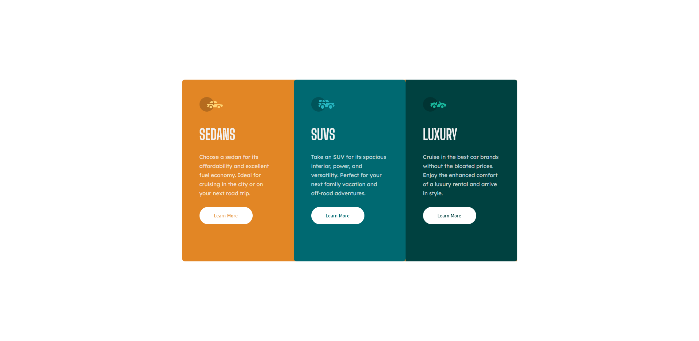

# Frontend Mentor - 3-column preview card component solution

This is a solution to the [3-column preview card component challenge on Frontend Mentor](https://www.frontendmentor.io/challenges/3column-preview-card-component-pH92eAR2-). Frontend Mentor challenges help you improve your coding skills by building realistic projects.

## Table of contents

- [Overview](#overview)
  - [The challenge](#the-challenge)
  - [Screenshot](#screenshot)
  - [Links](#links)
- [My process](#my-process)
  - [Built with](#built-with)
  - [Useful resources](#useful-resources)
- [Author](#author)
- [Acknowledgments](#acknowledgments)

## Overview

### The challenge

Users should be able to:

- View the optimal layout depending on their device's screen size
- See hover states for interactive elements

### Screenshot

### Links

- Solution URL: https://github.com/yurtsevero/_FrontendMentor.3-column-preview-card
- Live Site URL: https://yurtsevero.github.io/_FrontendMentor.3-column-preview-card/

## My process

### Built with

- Semantic HTML5 markup
- BEM methodology
- CSS3 , SASS
- Flexbox
- Mobile-first workflow

### Useful resources

- [Example resource 1](https://www.example.com) - This helped me for XYZ reason. I really liked this pattern and will use it going forward.
- [Example resource 2](https://www.example.com) - This is an amazing article which helped me finally understand XYZ. I'd recommend it to anyone still learning this concept.

## Author

- Linkedin- Onur Yurtsever - https://www.linkedin.com/in/oyurtsever/
- Frontend Mentor - @yurtsevero - https://www.frontendmentor.io/profile/yurtsevero
